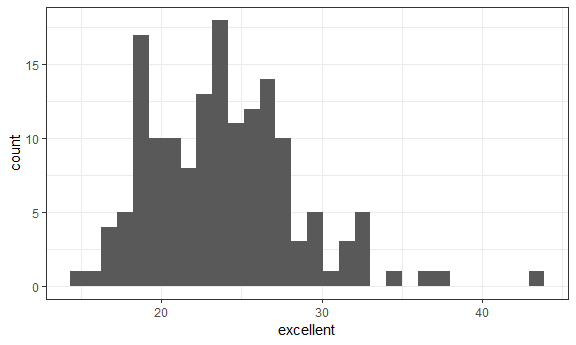

p8105\_hw2\_st3117
================
Sha Tao
September 27, 2018

Problem 1\_1 Table Cleaning
---------------------------

``` r
# import and clean data
transit = 
  read_csv(file = "./data/NYC_Transit_Subway_Entrance_And_Exit_Data.csv") %>% 
  janitor::clean_names() %>% 
  gather(key = routes_number, value = routes_name, route1:route11) %>% 
  separate(routes_number, into = c("remove1", "routes_number"), sep = 5) %>% 
  filter(!is.na(routes_name)) %>% 
  mutate(entry = ifelse(entry == "YES", yes = TRUE, no = FALSE)) %>% 
  select(line:station_longitude, routes_number, routes_name, entry, vending, entrance_type, ada) %>% 
  arrange(line, station_name)
```

    ## Parsed with column specification:
    ## cols(
    ##   .default = col_character(),
    ##   `Station Latitude` = col_double(),
    ##   `Station Longitude` = col_double(),
    ##   Route8 = col_integer(),
    ##   Route9 = col_integer(),
    ##   Route10 = col_integer(),
    ##   Route11 = col_integer(),
    ##   ADA = col_logical(),
    ##   `Free Crossover` = col_logical(),
    ##   `Entrance Latitude` = col_double(),
    ##   `Entrance Longitude` = col_double()
    ## )

    ## See spec(...) for full column specifications.

``` r
transit
```

    ## # A tibble: 4,270 x 10
    ##    line  station_name station_latitude station_longitu~ routes_number
    ##    <chr> <chr>                   <dbl>            <dbl> <chr>        
    ##  1 4 Av~ 25th St                  40.7            -74.0 1            
    ##  2 4 Av~ 25th St                  40.7            -74.0 1            
    ##  3 4 Av~ 36th St                  40.7            -74.0 1            
    ##  4 4 Av~ 36th St                  40.7            -74.0 1            
    ##  5 4 Av~ 36th St                  40.7            -74.0 1            
    ##  6 4 Av~ 36th St                  40.7            -74.0 2            
    ##  7 4 Av~ 36th St                  40.7            -74.0 2            
    ##  8 4 Av~ 36th St                  40.7            -74.0 2            
    ##  9 4 Av~ 45th St                  40.6            -74.0 1            
    ## 10 4 Av~ 45th St                  40.6            -74.0 1            
    ## # ... with 4,260 more rows, and 5 more variables: routes_name <chr>,
    ## #   entry <lgl>, vending <chr>, entrance_type <chr>, ada <lgl>

The dataset "transit" is a 10 by 4270 table.
It contains line, station\_name, latitude, longitude, routes\_number, routes\_name, entry, vending, entrance\_type and ADA compliance.
I started by importing the dataset and clean the variable names. Then, used gather function doing a wide to long transpose; used separate function getting routes\_number by itself; used filter function removing “NA”s in routes\_name; used ifelse function converting entry to a logical variable; seleted the variables as requested; and arrange them by line and station\_name.
This is a tidy dataset.

Problem 1\_2
------------

``` r
# How many distinct stations are there?
distinct(transit, line, station_name) %>% 
  nrow()
```

    ## [1] 465

``` r
# How many stations are ADA compliant?
filter(transit, ada == TRUE) %>% 
  distinct(line, station_name) %>% 
  nrow()
```

    ## [1] 84

``` r
# What proportion of station entrances / exits without vending allow entrance?
count(transit, vending == "YES") %>% 
  pull(n) %>% 
  prop.table()
```

    ## [1] 0.1046838 0.8953162

``` r
filter(transit, routes_name == "A") %>% 
  distinct(line, station_name, routes_number, routes_name) %>% 
  nrow()
```

    ## [1] 60

``` r
filter(transit, ada == TRUE & routes_name == "A") %>% 
  distinct(line, station_name, routes_number, routes_name) %>% 
  nrow()
```

    ## [1] 17

Problem 2\_1
------------

``` r
trash = 
  readxl::read_excel("./data/HealthyHarborWaterWheelTotals2017-9-26.xlsx", 
                     sheet = "Mr. Trash Wheel", range = readxl::cell_cols("A:N")) %>% 
  janitor::clean_names() %>%
  filter(!is.na(date)) %>% 
  mutate(
    sports_ball = round(sports_balls) %>% 
                  as.integer(sports_balls)
    )

#    year = ifelse(!is.na(year), year, substring(date, 1, 4)),

trash
```

    ## # A tibble: 215 x 15
    ##    dumpster month  year date                weight_tons volume_cubic_ya~
    ##       <dbl> <chr> <dbl> <dttm>                    <dbl>            <dbl>
    ##  1        1 May    2014 2014-05-16 00:00:00        4.31               18
    ##  2        2 May    2014 2014-05-16 00:00:00        2.74               13
    ##  3        3 May    2014 2014-05-16 00:00:00        3.45               15
    ##  4        4 May    2014 2014-05-17 00:00:00        3.1                15
    ##  5        5 May    2014 2014-05-17 00:00:00        4.06               18
    ##  6        6 May    2014 2014-05-20 00:00:00        2.71               13
    ##  7        7 May    2014 2014-05-21 00:00:00        1.91                8
    ##  8        8 May    2014 2014-05-28 00:00:00        3.7                16
    ##  9        9 June   2014 2014-06-05 00:00:00        2.52               14
    ## 10       10 June   2014 2014-06-11 00:00:00        3.76               18
    ## # ... with 205 more rows, and 9 more variables: plastic_bottles <dbl>,
    ## #   polystyrene <dbl>, cigarette_butts <dbl>, glass_bottles <dbl>,
    ## #   grocery_bags <dbl>, chip_bags <dbl>, sports_balls <dbl>,
    ## #   homes_powered <dbl>, sports_ball <int>

Problem 2\_2
------------

``` r
prec_2016 = 
  readxl::read_excel("./data/HealthyHarborWaterWheelTotals2017-9-26.xlsx",
                     sheet = "2016 Precipitation", range = "A2:B14") %>%
  janitor::clean_names() %>%
  mutate(year = "2016")
                              
prec_2017 = 
  readxl::read_excel("./data/HealthyHarborWaterWheelTotals2017-9-26.xlsx",
                     sheet = "2017 Precipitation", range = "A2:B14") %>%
  janitor::clean_names() %>%
  mutate(year = "2017") %>% 
  filter(!is.na(total))

precipitation = 
  bind_rows(prec_2016, prec_2017) %>%
  select(year, month, total) %>% 
  mutate(month = month.name[month])

precipitation
```

    ## # A tibble: 20 x 3
    ##    year  month     total
    ##    <chr> <chr>     <dbl>
    ##  1 2016  January    3.23
    ##  2 2016  February   5.32
    ##  3 2016  March      2.24
    ##  4 2016  April      1.78
    ##  5 2016  May        5.19
    ##  6 2016  June       3.2 
    ##  7 2016  July       6.09
    ##  8 2016  August     3.96
    ##  9 2016  September  4.53
    ## 10 2016  October    0.62
    ## 11 2016  November   1.47
    ## 12 2016  December   2.32
    ## 13 2017  January    2.34
    ## 14 2017  February   1.46
    ## 15 2017  March      3.57
    ## 16 2017  April      3.99
    ## 17 2017  May        5.64
    ## 18 2017  June       1.4 
    ## 19 2017  July       7.09
    ## 20 2017  August     4.44

``` r
filter(trash, year == 2016) %>% 
  pull(sports_ball) %>% 
  median()
```

    ## [1] 26

215

20

29.93

``` r
brfss = 
  brfss_smart2010 %>% 
  janitor::clean_names() %>%
  filter(topic == "Overall Health") %>% 
  separate(locationdesc, into = c("remove2", "county"), sep = 5) %>% 
  select(year, state = locationabbr, county, response, data_value) %>% 
  spread(key = response, value = data_value) %>% 
  janitor::clean_names() %>% 
  select(year:county, excellent, very_good, good, fair, poor) %>% 
  mutate(prop_above_good = (excellent + very_good)/(excellent + very_good + good + fair + poor))
```

``` r
#How many unique locations are included in the dataset?
location_distinct = distinct(brfss, state, county)

state_distinct = distinct(brfss, state)

count(location_distinct, state) %>% 
arrange(-n) %>% 
head(1)
```

    ## # A tibble: 1 x 2
    ##   state     n
    ##   <chr> <int>
    ## 1 FL       44

``` r
brfss_2002 = filter(brfss, year == 2002)

pull(brfss, excellent) %>% 
  median(na.rm = TRUE)
```

    ## [1] 22

``` r
ggplot(brfss_2002, aes(x = excellent)) + 
  geom_histogram()
```

    ## `stat_bin()` using `bins = 30`. Pick better value with `binwidth`.

    ## Warning: Removed 2 rows containing non-finite values (stat_bin).



``` r
brfss_ny = filter(brfss, county == "New York County" | county == "Queens County") %>% 
  arrange(county, year)

ggplot(brfss_ny, aes(x = year, y = prop_above_good)) + 
  geom_point(aes(color = county))
```


