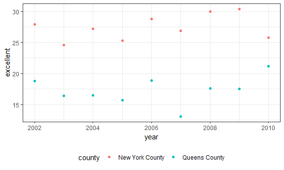
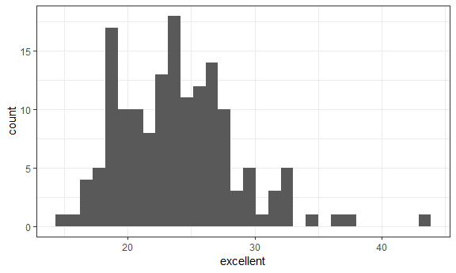

p8105\_hw2\_st3117
================
Sha Tao
September 27, 2018

Problem 1\_1 NYC Transit Data Cleaning
--------------------------------------

``` r
# import and clean data
transit = 
  read_csv(file = "./data/NYC_Transit_Subway_Entrance_And_Exit_Data.csv") %>% 
  janitor::clean_names() %>% 
  gather(key = routes_number, value = routes_name, route1:route11) %>% 
  separate(routes_number, into = c("remove1", "routes_number"), sep = 5) %>% 
  filter(!is.na(routes_name)) %>% 
  mutate(entry = ifelse(entry == "YES", yes = TRUE, no = FALSE)) %>% 
  select(line:station_longitude, routes_number, routes_name, entry, vending, entrance_type, ada) %>% 
  arrange(line, station_name)
```

The dataset "transit" is a 10 by 4270 table.
It contains variables including line, station\_name, latitude, longitude, routes\_number, routes\_name, entry, vending, entrance\_type and ADA compliance.
I started by importing the dataset and clean the variable names. Then, I used 'gather' function doing a wide to long transpose; used 'separate' function removing characters "route" from routes\_number; used 'filter' function removing “NA”s in routes\_name; used 'ifelse' function converting entry to a logical variable; seleted the 10 variables as requested; and arrange them by line and station\_name.
</br> This is a tidy dataset.

Problem 1\_2 Answer Questions
-----------------------------

-   How many distinct stations are there?
    There are 465 distinct stations.
    </br>
-   How many stations are ADA compliant?
    84 stations are ADA compliant.
    </br>
-   What proportion of station entrances / exits without vending allow entrance?
    43.43% station entrances / exits without vending allow entrance.

Problem 1\_3 Reformat Data and Answer Questions
-----------------------------------------------

-   How many distinct stations serve the A train?
    There are 60 distinct stations serve the A train.
    </br>
-   Of the stations that serve the A train, how many are ADA compliant?
    17 Of the stations that serve the A train are ADA compliant.

Problem 2\_1 Mr. Trash Wheel Data Cleaning
------------------------------------------

``` r
# import and clean data
trash = 
  readxl::read_excel("./data/HealthyHarborWaterWheelTotals2018-7-28.xlsx", 
                     sheet = "Mr. Trash Wheel", range = readxl::cell_cols("A:N")) %>% 
  janitor::clean_names() %>%
  filter(!is.na(dumpster)) %>% 
  mutate(
    sports_balls = round(sports_balls) %>% 
                   as.integer(sports_balls)
    )
```

Problem 2\_2 Precipitation Data Cleaning
----------------------------------------

``` r
# import and clean data for 2016
prec_2016 = 
  readxl::read_excel("./data/HealthyHarborWaterWheelTotals2018-7-28.xlsx",
                     sheet = "2016 Precipitation", range = "A2:B14") %>%
  janitor::clean_names() %>%
  mutate(year = "2016")

# import and clean data for 2017                             
prec_2017 = 
  readxl::read_excel("./data/HealthyHarborWaterWheelTotals2018-7-28.xlsx",
                     sheet = "2017 Precipitation", range = "A2:B14") %>%
  janitor::clean_names() %>%
  mutate(year = "2017") 
  
# note: the previous dataset contains NAs for precipitation thus need ' %>% filter(!is.na(total))', but this one is complete.

# combine the 2016 and 2017 datasets, and change month type
precipitation = 
  bind_rows(prec_2016, prec_2017) %>%
  select(year, month, total) %>% 
  mutate(month = month.name[month])
```

Problem 2\_3 Describe Two Datasets
----------------------------------

``` r
# Find the highest total precipitation
arrange(precipitation, -total) %>% 
  head(1)
```

    ## # A tibble: 1 x 3
    ##   year  month total
    ##   <chr> <chr> <dbl>
    ## 1 2017  July   7.09

After cleaning, the dataset ‘trash’ is a 14 by 285 (observations) table. It includes the trash weight and trash types collected by the Mr. Trash Wheel from 2017 to 2018. The key variables are weight\_tons and homes\_powered. From the dataset, we know that each dumpster collected 3.28 tons on average, and they powered 1.19506710^{4} homes in total for the two years.
The dataset ‘precipitation’ is a 3 by 24 (observations) table. It records the monthly total precipitation from 2016 to 2017. The key variables are total\_precipitation. From the dataset, we know that the monthly total percipitation is3.04 inches on average, and the highest total monthly precipitation occured in July, 2017 with 7.09 inches.
\#\# Problem 2\_4 Answer Questions

``` r
filter(trash, year == 2016) %>% 
  pull(sports_balls) %>% 
  median(na.rm = TRUE)
```

    ## [1] 26

-   what was the total precipitation in 2017?
    The total precipitation in 2017 are 32.93 inches.
    </br>
-   What was the median number of sports balls in a dumpster in 2016?
    The median number of sports balls in a dumpster in 2016 are 26.

``` r
brfss = 
  brfss_smart2010 %>% 
  janitor::clean_names() %>%
  filter(topic == "Overall Health") %>% 
  separate(locationdesc, into = c("remove2", "county"), sep = 5) %>% 
  select(year, state = locationabbr, county, response, data_value) %>% 
  spread(key = response, value = data_value) %>% 
  janitor::clean_names() %>% 
  select(year:county, excellent, very_good, good, fair, poor) %>% 
  mutate(above_good = excellent + very_good)
  
brfss
```

    ## # A tibble: 2,125 x 9
    ##     year state county     excellent very_good  good  fair  poor above_good
    ##    <int> <chr> <chr>          <dbl>     <dbl> <dbl> <dbl> <dbl>      <dbl>
    ##  1  2002 AK    Anchorage~      27.9      33.7  23.8   8.6   5.9       61.6
    ##  2  2002 AL    Jefferson~      18.5      30.9  32.7  12.1   5.9       49.4
    ##  3  2002 AR    Pulaski C~      24.1      29.3  29.9  12.5   4.2       53.4
    ##  4  2002 AZ    Maricopa ~      21.6      36.6  26.9  10.3   4.6       58.2
    ##  5  2002 AZ    Pima Coun~      26.6      30.1  31.9   7.5   3.9       56.7
    ##  6  2002 CA    Los Angel~      22.7      29.8  28.7  14.3   4.5       52.5
    ##  7  2002 CO    Adams Cou~      21.2      31.2  29    14.4   4.2       52.4
    ##  8  2002 CO    Arapahoe ~      25.5      35.2  29.3   8     2.1       60.7
    ##  9  2002 CO    Denver Co~      22.2      27.1  36.6  11.1   3         49.3
    ## 10  2002 CO    Jefferson~      23.4      36.6  26.3  11.4   2.4       60  
    ## # ... with 2,115 more rows

``` r
#How many unique locations are included in the dataset?
location_distinct = distinct(brfss, state, county)

state_distinct = distinct(brfss, state)

count(location_distinct, state) %>% 
arrange(-n) %>% 
head(1)
```

    ## # A tibble: 1 x 2
    ##   state     n
    ##   <chr> <int>
    ## 1 FL       44

``` r
count(brfss, state) %>% 
arrange(-n) %>% 
head(1)
```

    ## # A tibble: 1 x 2
    ##   state     n
    ##   <chr> <int>
    ## 1 NJ      146

``` r
brfss_2002 = filter(brfss, year == 2002)

pull(brfss_2002, excellent) %>% 
  median(na.rm = TRUE)
```

    ## [1] 23.6

``` r
filter(brfss, year == 2002) %>% 
  pull(excellent) %>% 
  median(na.rm = TRUE)
```

    ## [1] 23.6

``` r
pull(brfss, excellent) %>% 
  median(na.rm = TRUE)
```

    ## [1] 22

``` r
ggplot(brfss_2002, aes(x = excellent)) + 
  geom_histogram()
```

    ## `stat_bin()` using `bins = 30`. Pick better value with `binwidth`.

    ## Warning: Removed 2 rows containing non-finite values (stat_bin).



``` r
filter(brfss, year == 2002) %>% 
  ggplot(aes(x = excellent)) + 
  geom_histogram()
```

    ## `stat_bin()` using `bins = 30`. Pick better value with `binwidth`.

    ## Warning: Removed 2 rows containing non-finite values (stat_bin).



``` r
brfss_ny = filter(brfss, county == "New York County" | county == "Queens County") %>% 
  arrange(county, year)

ggplot(brfss_ny, aes(x = year, y = excellent)) + 
  geom_point(aes(color = county))
```


